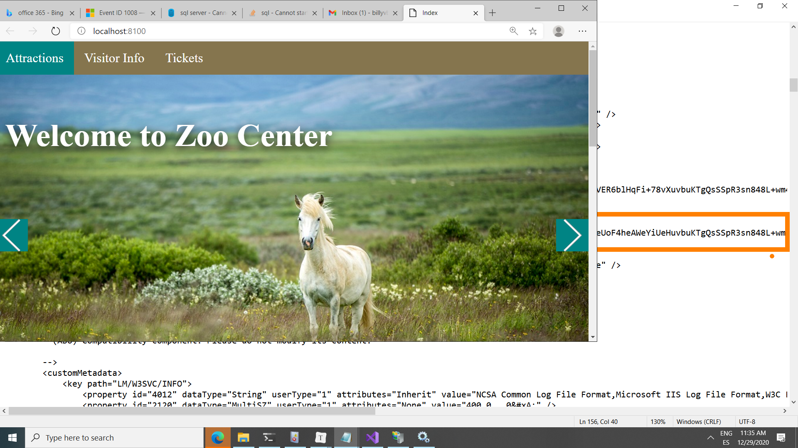
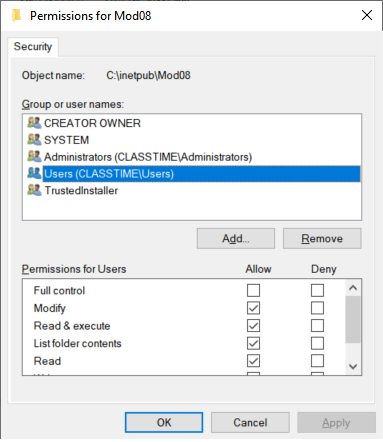
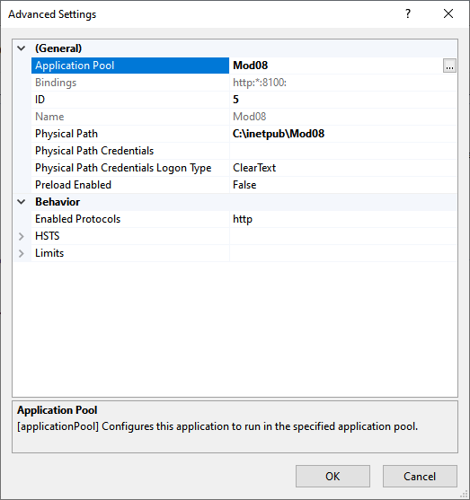
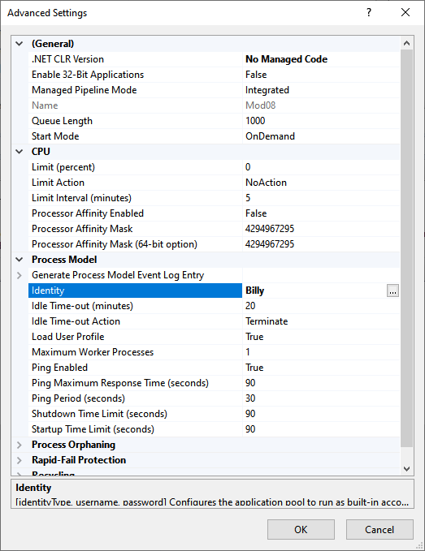
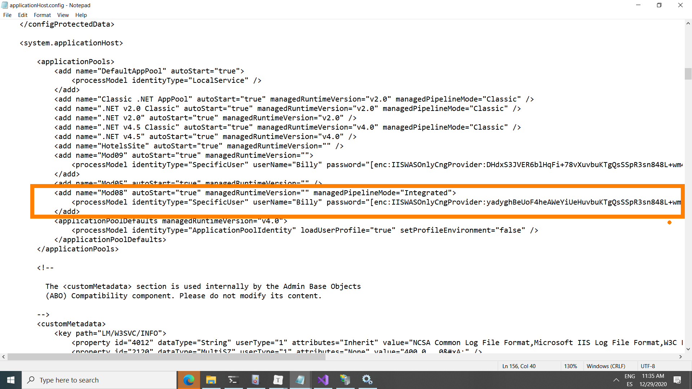

## Correccion de Error en el IIS deployment con SQL LocalDB

Desplegar el laboratorio final del módulo 8 del curso 20486D utilizando SQLLocalDB con IIS en Windows 10 pro, ha resultado un pequeño reto.

```
Resultado final, la base de datos es accesible y el Site en IIS funciona con ella.
```




### SQL Server Express LocalDB

Microsoft SQL Server Express LocalDB es una característica de [SQL Server Express](https://docs.microsoft.com/es-es/sql/sql-server/editions-and-components-of-sql-server-version-15?view=sql-server-ver15) dirigida a los desarrolladores. Está disponible en SQL Server Express con Advanced Services.

La instalación de LocalDB copia un conjunto de archivos mínimo necesario para iniciar el Motor de base de datos de SQL Server. Una vez que LocalDB está instalado, puede iniciar una conexión mediante una cadena de conexión especial. Cuando se realiza la conexión, se crea y se inicia automáticamente la infraestructura de SQL Server necesaria, permitiendo que la aplicación use la base de datos sin tareas de configuración complejas. Las herramientas de desarrollo pueden proporcionar a los desarrolladores de software un Motor de base de datos de SQL Server que les permite escribir y probar el código de Transact-SQL sin tener que administrar una instancia de servidor completa de SQL Server.

## Medios de instalación

LocalDB es una característica que se selecciona durante la instalación de SQL Server Express y está disponible al descargar los medios. Si descarga los medios, elija **Express Advanced** o el paquete de LocalDB.

- [SQL Server Express 2019](https://go.microsoft.com/fwlink/?LinkID=866658)
- [SQL Server Express 2017](https://go.microsoft.com/fwlink/?LinkID=853017)
- [SQL Server Express 2016](https://go.microsoft.com/fwlink/?LinkID=799012)

Como alternativa, puede instalar LocalDB a través del [Instalador de Visual Studio](https://visualstudio.microsoft.com/downloads/), como parte de la carga de trabajo de **almacenamiento y procesamiento de datos**, la carga de trabajo de **ASP.NET y desarrollo web** o como un componente individual.

Mayor Información:

[SQL Server Express LocalDB - SQL Server | Microsoft Docs](https://docs.microsoft.com/es-es/sql/database-engine/configure-windows/sql-server-express-localdb?view=sql-server-ver15)

## SQL LocalDB con IIS

Para utilizar SQL Server Express con IIS he configurado los siguientes puntos.

#### Trazas en la carpeta de  C:\inetpub\Mod08\

Habilitar el fichero de configuración web en la carpeta de publicación para que muestre las trazas de errores, se ha de crear una carpeta con el nombre de **Logs** asi: *C:\inetpub\Mod08\Logs*.

**Web.Config**

```xml
<?xml version="1.0" encoding="utf-8"?>
<configuration>
  <location path="." inheritInChildApplications="false">
    <system.webServer>
      <handlers>
        <add name="aspNetCore" path="*" verb="*" modules="AspNetCoreModule" resourceType="Unspecified" />
      </handlers>
      <aspNetCore processPath="dotnet" arguments=".\ZooSite.dll" stdoutLogEnabled="true" stdoutLogFile=".\logs\stdout" />
    </system.webServer>
  </location>
</configuration>
<!--ProjectGuid: 421582ec-608d-4882-b674-39e392eb74d8-->
```

### Revision de errores en las trazas resultantes

La anterior configuración, dejará los errores en la carpeta .\logs\ de la carpeta de despliegue en IIS.

La cadena de conexión inicial no es suficiente para crear la base de datos.

```
info: Microsoft.AspNetCore.DataProtection.KeyManagement.XmlKeyManager[0]
      User profile is available. Using 'C:\WINDOWS\system32\config\systemprofile\AppData\Local\ASP.NET\DataProtection-Keys' as key repository and Windows DPAPI to encrypt keys at rest.
info: Microsoft.EntityFrameworkCore.Infrastructure[10403]
      Entity Framework Core 2.1.14-servicing-32113 initialized 'ZooContext' using provider 'Microsoft.EntityFrameworkCore.SqlServer' with options: None
Application startup exception: System.Data.SqlClient.SqlException (0x80131904): A network-related or instance-specific error occurred while establishing a connection to SQL Server. The server was not found or was not accessible. Verify that the instance name is correct and that SQL Server is configured to allow remote connections. (provider: SQL Network Interfaces, error: 50 - Local Database Runtime error occurred. Error occurred during LocalDB instance startup: SQL Server process failed to start.
) ---> System.ComponentModel.Win32Exception (0x89C5010A): Unknown error (0x89c5010a)
```


### Modificación de la cadena de conexión para llevar los ficheros de la base de datos en la carpeta de despliegue del proyecto

Con la anterior traza se ha investigado y todo apunta que el fichero debe ser adjunto y localizado en la carpeta de despliegue,  se ha añadido en la cadena de conexión los ficheros adjuntos de la base de datos.

```json
"Server=(localdb)\\MSSQLLocalDB;Integrated Security=true;Initial Catalog=zoodb2020v20;AttachDbFileName=C:\\inetpub\\Mod08\\zoodb2020v20.mdf;Connect Timeout=30"
```

La cadena de conexión deberá ser la siguiente:

**appsettings.json**

```json
{
  "ConnectionStrings": {
    "DefaultConnection":"Server=(localdb)\\MSSQLLocalDB;Integrated Security=true;Initial Catalog=zoodb2020v20;AttachDbFileName=C:\\inetpub\\Mod08\\zoodb2020v20.mdf;Connect Timeout=30"
	}
}
```


### Dar permisos a la carpeta donde se aloja la base de datos para que el IIS y el usuario del AppPool puedan manipularla.

La siguiente traza nos informa que el usuario del AppPool dentro del contexto del IIS,  no tienen los suficientes permisos en la carpeta donde se alojan los ficheros

```
info: Microsoft.AspNetCore.DataProtection.KeyManagement.XmlKeyManager[0]
      User profile is available. Using 'C:\Users\Billy Vanegas\AppData\Local\ASP.NET\DataProtection-Keys' as key repository and Windows DPAPI to encrypt keys at rest.
info: Microsoft.EntityFrameworkCore.Infrastructure[10403]
      Entity Framework Core 2.1.14-servicing-32113 initialized 'ZooContext' using provider 'Microsoft.EntityFrameworkCore.SqlServer' with options: None
fail: Microsoft.EntityFrameworkCore.Database.Command[20102]
      Failed executing DbCommand (21ms) [Parameters=[], CommandType='Text', CommandTimeout='60']
      CREATE DATABASE [zoodb2020v20]
      ON (NAME = N'zoodb2020v20', FILENAME = N'C:\inetpub\Mod08\zoodb2020v20.mdf')
      LOG ON (NAME = N'zoodb2020v20_log', FILENAME = N'C:\inetpub\Mod08\zoodb2020v20_log.ldf');
System.Data.SqlClient.SqlException (0x80131904): CREATE FILE encountered operating system error 5(Access is denied.) while attempting to open or create the physical file 'C:\inetpub\Mod08\zoodb2020v20.mdf'.
CREATE DATABASE failed. Some file names listed could not be created. Check related errors.
```

Mod08 permissions en la carpeta c:\inetpub\Mod08



IIS Advanced Settings en el WebSite:




Configuración del Application Pool Mod08




### Modificando el fichero de configuración de IIS

Por último se configur en la ruta: C:\Windows\System32\inetsrv\config el fichero **applicationHost.config**

Linea: Aproximadamente 145

```xml
 <applicationPools>
            <add name="DefaultAppPool" autoStart="true">
                <processModel identityType="LocalService" />
            </add>
            <add name="Classic .NET AppPool" autoStart="true" managedRuntimeVersion="v2.0" managedPipelineMode="Classic" />
            <add name=".NET v2.0 Classic" autoStart="true" managedRuntimeVersion="v2.0" managedPipelineMode="Classic" />
            <add name=".NET v2.0" autoStart="true" managedRuntimeVersion="v2.0" />
            <add name=".NET v4.5 Classic" autoStart="true" managedRuntimeVersion="v4.0" managedPipelineMode="Classic" />
            <add name=".NET v4.5" autoStart="true" managedRuntimeVersion="v4.0" />
            <add name="HotelsSite" autoStart="true" managedRuntimeVersion="" />
            <add name="Mod09" autoStart="true" managedRuntimeVersion="">
                <processModel identityType="SpecificUser" userName="Billy" password="[enc:IISWASOnlyCngProvider:DD3sxS3JVER6blHqFi+78vXuvbuKTgQsSSpR3sn848L+wm4M2SYlZutqIT1/RN6Dvb0/S41/hps8hAaWDoKmrvdg==:enc]" />
            </add>
            <add name="Mod05" autoStart="true" managedRuntimeVersion="" />
            <add name="Mod08" autoStart="true" managedRuntimeVersion="" managedPipelineMode="Integrated">
                <processModel identityType="SpecificUser" userName="Billy" password="[enc:IISWASOnlyCngProvider:yadygDW1214heAWeYiUeHuvbuKTgQsSSpR3sn848L+wm4M2SYlZutqIT1/RN6Dv5DKzZpWzHaKqQ/0M11jBlgA==:enc]" loadUserProfile="true" setProfileEnvironment="true" />
            </add>
            <applicationPoolDefaults managedRuntimeVersion="v4.0">
                <processModel identityType="ApplicationPoolIdentity" loadUserProfile="true" setProfileEnvironment="false" />
            </applicationPoolDefaults>
        </applicationPools>
```




### Traza final

La base de datos se crea correctamente:

```
info: Microsoft.AspNetCore.DataProtection.KeyManagement.XmlKeyManager[0]
      User profile is available. Using 'C:\Users\Billy Vanegas\AppData\Local\ASP.NET\DataProtection-Keys' as key repository and Windows DPAPI to encrypt keys at rest.
info: Microsoft.EntityFrameworkCore.Infrastructure[10403]
      Entity Framework Core 2.1.14-servicing-32113 initialized 'ZooContext' using provider 'Microsoft.EntityFrameworkCore.SqlServer' with options: None
info: Microsoft.EntityFrameworkCore.Database.Command[20101]
      Executed DbCommand (246ms) [Parameters=[], CommandType='Text', CommandTimeout='60']
      CREATE DATABASE [zoodb2020v20]
      ON (NAME = N'zoodb2020v20', FILENAME = N'C:\inetpub\Mod08\zoodb2020v20.mdf')
      LOG ON (NAME = N'zoodb2020v20_log', FILENAME = N'C:\inetpub\Mod08\zoodb2020v20_log.ldf');
info: Microsoft.EntityFrameworkCore.Database.Command[20101]
      Executed DbCommand (71ms) [Parameters=[], CommandType='Text', CommandTimeout='60']
      IF SERVERPROPERTY('EngineEdition') <> 5
      BEGIN
          ALTER DATABASE [zoodb2020v20] SET READ_COMMITTED_SNAPSHOT ON;
      END;
```

### Conclusiones 

Una vez que los ficheros que conforman la base de datos SQL LocalDB, son ficheros que correrán en las instancias publicas o privadas, deberán estar locales y en la carpeta de despliegue de la aplicación publicada, estos ficheros son el fichero de *.mdf y *.ldf (Datos y Logs)

**Nota:** si la base de datos ya existe en la instancia, deberá, asegurarse de que los ficheros de creación esten en la ruta de despliegue del proyecto en la carpeta de IIS, de lo contrario debera borrarla o realizar un detach.

Es laboriosa la configuración inicial de despliegue con el motor de la base de datos SQLLocal DB, pero es importante entender su funcionamiento antes de desplegar en el IIS sobre Win 10 pro.


### Mayor información

[Using LocalDB with Full IIS, Part 1: User Profile | Microsoft Docs](https://docs.microsoft.com/en-us/archive/blogs/sqlexpress/using-localdb-with-full-iis-part-1-user-profile)

[sql - Cannot start LocalDB - Stack Overflow](https://stackoverflow.com/questions/13287252/cannot-start-localdb#comment47465899_27257343)

[sql server - Cannot start SqlLocalDB instance with my Windows account - Database Administrators Stack Exchange](https://dba.stackexchange.com/questions/30383/cannot-start-sqllocaldb-instance-with-my-windows-account)

